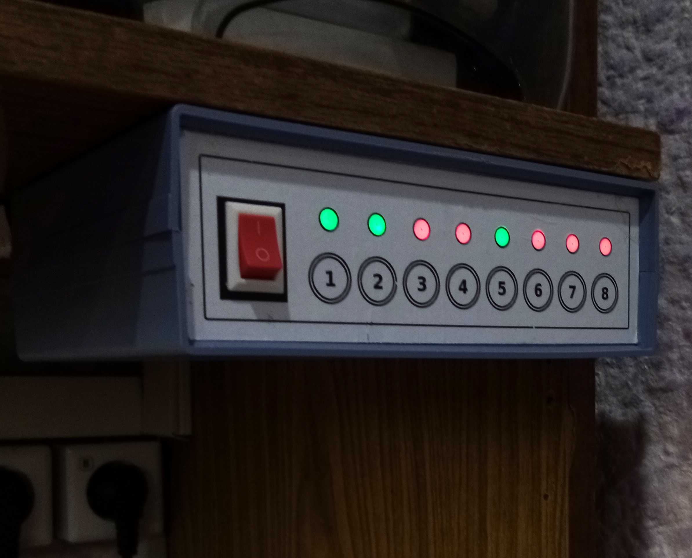

**relay_switch 0.5** - простой восьмиканальный коммутатор нагрузки, построенный на микроконтроллере **Attiny88 (MH-Tiny)** и восьмиканальном релейном модуле.



Для работы с **Attiny88** можно использовать пакет **ATTinyCore**, адрес для установки в Arduino IDE - `http://drazzy.com/package_drazzy.com_index.json`

Реле в модуле могут управляться как высоким, так и низким уровнем. Нужный уровень задается переменной `control_level`.

Коммутатор управляется восемью кнопками, по одной на каждый канал. Можно использовать как обычные тактовые кнопки с подтяжкой к VCC (INPUT_PULLUP), так и сенсорные с высоким уровнем при срабатывании. Для использования сенсорных кнопок нужно раскомментировать строку `#define USE_TOUCH_BUTTON` в скетче.

Состояние каналов визуализируется с помощью адресных светодиодов: 
- индикатор светится красным - нагрузка выключена
- индикатор светится зеленым - нагрузка включена
- индикатор не светится - канал не задействован

Любой канал может быть отключен и перестанет реагировать на свою кнопку. Для этого нужно нажать и удерживать нажатой кнопку канала, пока не погаснет его индикатор. Включение канала выполняется так же.

<hr>

Вместо **Attiny88** можно использовать плату **Arduino (UNO, Nano, Pro mini)** на базе **ATmega328p** или **ATmega168**.

Используемые сторонние библиотеки

**shButton.h** - https://github.com/VAleSh-Soft/shButton<br>
**FastLED.h** - https://github.com/FastLED/FastLED<br>

Note: библиотека **FastLED** до версии 3.6.0 по умолчанию не поддерживает **Attiny88/48**. Для добавления поддержки нужно либо обновить библиотеку, либо вручную внести изменения в пару файлов:

=== файл `FastLED/src/platforms/avr/fastpin_avr.h` ======

Необходимо добавить описание пинов ардуино для этих МК. Для этого нужно найти, например, строку 

`#elif defined(__AVR_ATtiny841__) || defined(__AVR_ATtiny441__)`

и **перед** ней вставить следующий код:

```
#elif defined(__AVR_ATtiny48__) || defined(__AVR_ATtiny88__)

#define MAX_PIN 27
_FL_DEFPIN( 0, 0, D); _FL_DEFPIN( 1, 1, D); _FL_DEFPIN( 2, 2, D); _FL_DEFPIN( 3, 3, D);
_FL_DEFPIN( 4, 4, D); _FL_DEFPIN( 5, 5, D); _FL_DEFPIN( 6, 6, D); _FL_DEFPIN( 7, 7, D);
_FL_DEFPIN( 8, 0, B); _FL_DEFPIN( 9, 1, B); _FL_DEFPIN(10, 2, B); _FL_DEFPIN(11, 3, B);
_FL_DEFPIN(12, 4, B); _FL_DEFPIN(13, 5, B); _FL_DEFPIN(14, 7, B); _FL_DEFPIN(15, 2, A);
_FL_DEFPIN(16, 3, A); _FL_DEFPIN(17, 0, A); _FL_DEFPIN(18, 1, A); _FL_DEFPIN(19, 0, C);
_FL_DEFPIN(20, 1, C); _FL_DEFPIN(21, 2, C); _FL_DEFPIN(22, 3, C); _FL_DEFPIN(23, 4, C);
_FL_DEFPIN(24, 5, C); _FL_DEFPIN(25, 7, C);

#define SPI_DATA 11
#define SPI_CLOCK 13
#define SPI_SELECT 10
#define AVR_HARDWARE_SPI 1
#define HAS_HARDWARE_PIN_SUPPORT 1
```

=== файл `FastLED/src/platforms/avr/led_sysdefs_avr.h` ======

Необходимо добавить определение для Attiny88/48. Для этого нужно найти блок кода, отмеченного комментарием

`// special defs for the tiny environments`

и добавить в следующую за ним строку следующий код (если его нет)

```
 || defined(__AVR_ATtiny48__) || defined(__AVR_ATtiny88__)
```

==============================================================

После сохранения изменений поддержка МК Attiny88/48 в FastLED появится.

Пины для подключения кнопок, реле и адресной ленты описаны в скетче.

<hr>

Если возникнут вопросы, пишите на valesh-soft@yandex.ru 